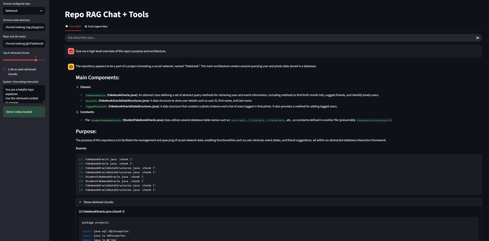
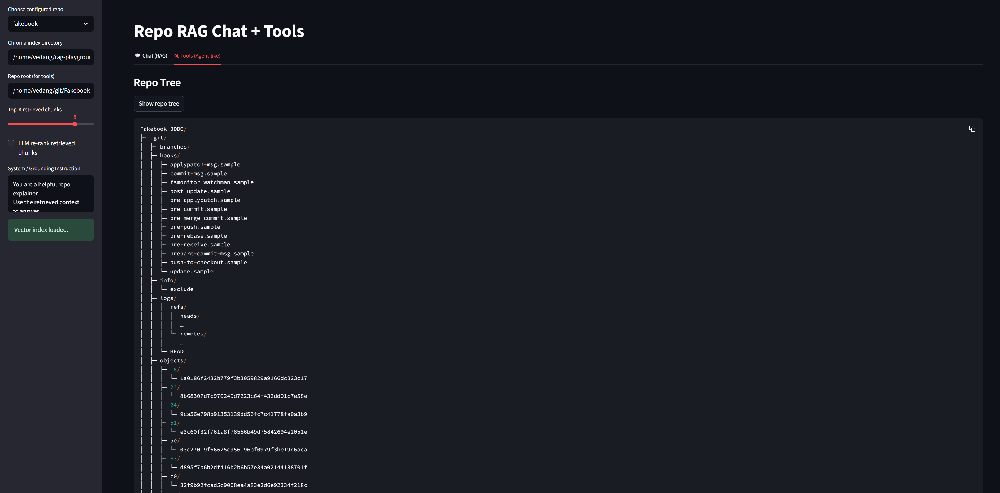

# Repo RAG Chat (LangChain + Chroma + OpenAI)

A lightweight Repo Explainer that answers questions about a codebase using RAG (Retrieval-Augmented Generation).  
It indexes a repository, retrieves relevant code/doc chunks, and generates grounded answers with file-path citations.

**Tech stack:** Python, Streamlit, LangChain, ChromaDB, OpenAI (GPT-4o mini), tiktoken

---

##  Features
- **RAG over your repo:** split → embed → store → retrieve → generate
- **File-path citations:** view the exact retrieved chunks used in each answer
- **Simple Streamlit UI:** ask questions, inspect retrieved context
- **Built-in tools:** show repo tree and read files from the UI

---

##  Quick Start

### 1) Clone & create a virtual environment
```bash
git clone <your-repo-url>
cd rag-playground

# Linux/Mac
python3 -m venv .venv
source .venv/bin/activate

# Windows PowerShell
py -3 -m venv .venv
.venv\Scripts\Activate.ps1
```

### 2) Install dependencies 
```bash
pip install -r requirements.txt
```

### 3) Set your OpenAI API key
Create an API key at platform.openai.com.

```bash
# Mac/Linux (bash/zsh):
export OPENAI_API_KEY="sk-..."
Add the same line to ~/.bashrc or ~/.zshrc to make it persistent.

# Windows PowerShell:
setx OPENAI_API_KEY "sk-..."

# Verify the key:
echo $OPENAI_API_KEY        # Mac/Linux
echo $env:OPENAI_API_KEY    # Windows PowerShell
```

### 4) Ingest (index) a repository
Point to the repo you want to chat over:
```bash
python ingest.py \
  --source /ABS/PATH/TO/your-repo \
  --persist ./chroma_index \
  --chunk_size 1000 --chunk_overlap 150
  ```

Expected output:
Embedding 91 chunks…
✅ Indexed 91 chunks from 7 files into ./chroma_index

### 5) Run the Streamlit app
```bash
streamlit run app_streamlit.py
```

Open the local URL shown (typically http://localhost:8501) and start asking questions such as:

“Give me a high-level overview of this repo.”
“Where is the database code?”
“Explain how FakebookOracle is used.”

Use the sidebar to:
Adjust Top-K retrieved chunks
Toggle optional re-ranking
Change index directory or repo root

📸 Screenshots:





🛠️ Tech Highlights
Retrieval-Augmented Generation: splits files → embeds → stores → retrieves → answers
Vector DB: ChromaDB with OpenAI embeddings for fast similarity search
Frontend: Streamlit chat UI with repo tree viewer and file inspection
Modular design (utils_repo.py) makes it easy to extend with more tools or different LLMs

